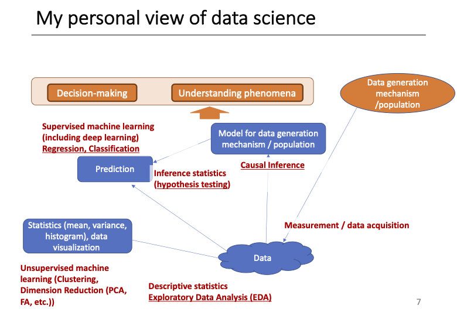

# About the Course {#course}

## Coures Information

### About 'QALL401 Data Analysis for Researchers'

> An introduction to data science (DS). It is an exploratory data analysis (EDA) that is an essential part of scientific research and an evidence-based decision making of a responsible global citizen. Students acquire the knowledge and learn the necessary principles for appropriate computer utilization in making research results public in order to communicate the outcomes. Since data science supports technologies of artificial intelligence, ethical issues are becoming more and more important.

> We introduce R, a widely used free software environment for statistical computing and graphics, and Rmarkdown, an authoring format that enables easy creation of dynamic documents, presentations, and reports from R, supporting reproducible research and literate programming.

> We will experience the process of data science and set a foundation to delovep data science skills and take time to think about the ethical issues of its outcomes.

**Instructors**: Keisuke Ishibashi, Taisei Kaizoji and Hiroshi Suzuki

**Description**: This course will help students from many academic fields develop skills to obtain necessary information from open data, as well as make charting and graphing for visualization. Students also learn fundamentals of data analysis and write short articles including data reasoning. The laboratory work uses open software such as R, and guest lectures on data analysis for research are included.

**Key Words**: open data, data visualization, data analysis, data reasoning, R

**Features**: laboratory work - practicum, write short articles, guest lectures

## Introduction by Professor Kaizoji

### Introduction (Slide Presentation 1)

**Necessity of Information Literacy and Statistical Analysis**

1. Big Data
  * [Big Data](https://www.youtube.com/watch?v=bAyrObl7TYE) 
  <iframe width="747" height="420" src="https://www.youtube.com/embed/bAyrObl7TYE" title="Big Data In 5 Minutes | What Is Big Data?| Introduction To Big Data |Big Data Explained |Simplilearn" frameborder="0" allow="accelerometer; autoplay; clipboard-write; encrypted-media; gyroscope; picture-in-picture" allowfullscreen></iframe>
    - Five V's: Volume, Velocity, Variety, Veracity, Value
    - [HADOOP](https://hadoop.apache.org)
  * A new generation of Open Data: US Government: [DATA.GOV](https://data.gov)
  * [Google Public Data Explorer](https://www.google.com/publicdata/directory?hl=en_US&dl=en_US#!)
    - [Youtube Video](https://www.youtube.com/watch?v=AM6w_tUlIn4)
  <iframe width="747" height="420" src="https://www.youtube.com/embed/AM6w_tUlIn4" title="Google Public Data Explorer" frameborder="0" allow="accelerometer; autoplay; clipboard-write; encrypted-media; gyroscope; picture-in-picture" allowfullscreen></iframe>
  * [Our World in Data](https://ourworldindata.org) 
    - [Our World in Data: COVID-19](https://ourworldindata.org/coronavirus)
  * [Data Analysis: COVID-19 Community Mobility Reports](https://www.google.com/covid19/mobility/?hl=en)
2. Explanatory Data Analysis(EDA)
  1. Getting Data
  2. Visualizing the data
  3. Statistically analyzing
  4. Making new discoveries
3. Statistical hypothesis testing 
  1. Building up a hypothesis
  2. Getting data
  3. Analyzing the data
  4. Testing the hypothesis
4. [R-Project](http://www.r-project.org)
  * The R language is an open source and free software programming language for statistical analysis.
  * The R language was created by Ross Ihaka and Robert Clifford Gentleman at the University of Auckland, New Zealand. It is now maintained and extended by the R Development Core Team. 
  * [R programming for beginners - Why you should use R](https://www.youtube.com/watch?v=9kYUGMg_14s)
  <iframe width="747" height="420" src="https://www.youtube.com/embed/9kYUGMg_14s" title="R programming for beginners -  Why you should use R" frameborder="0" allow="accelerometer; autoplay; clipboard-write; encrypted-media; gyroscope; picture-in-picture" allowfullscreen></iframe>
  * [The R Graph Gallery](https://r-graph-gallery.com)
  * [Extensive statistical packages](https://cran.ism.ac.jp/index.html)
  
### Data Analytics / Data Science Overview (Slide Presentation 2)

1. What is data science / data analytics?
  * Extract knowledge from data for decision-making and/or understanding phenomena
    - understanding phenomena : infer mechanism that generates the observed data
    - decision-making: determine what action to obtain the optimal output from the observed data
2. Examples
  * Education
    - Is early English learning effective?
  * Medical
    - Is COVID-19 Vaccine effective?
  * Politics
    - Was lockdown beneficial in decreasing the number of new cases in infection? How about the effect for economics? 
  * Business
    - Does online personal ad increase the sales? How much? 
  * Climate
    - Is increase of CO2 related to the temperature increase? 
  * Health
    - Is carbohydrate restriction effective for diet?
  * Sports
    - Does sacrifice bunt increase the probability of game win?
3. Understanding phenomena and making decisions based on data
  * Make decisions based on assumptions without basis or a few examples
  * Understanding phenomena and making decisions based on data, while leaving the mechanisms that cause the phenomena as a black box to some extent. Inductive reasoning
  * Elucidate the mechanisms that cause phenomena and make decisions based on those mechanisms.
4. Example of data science
  * Kepler
    - Infer the planetary orbits as ellipse from the observed data (Finding a phenomenon)
    - Before Newton discovered universal gravitation.
  * Nightingale
    - Find that the main cause of death among soldiers was poor sanitation in hospitals by
analyzing the data on dead and sick soldiers in the Crimean War. Reduced the mortality rate from 42% to 5% (Decision- making).
    - Before the German bacteriologist Koch discovered that bacteria were the cause of infections.
5. Why data science / data analytics?
  * The following two movement put the data-science approach
  * Increase of available data => Open data (Prof. Kaizoji)
  * Increase of computational power that can process the above huge data
  
  
### R and R Studio

  * [The Comprehensive R Archive Network](https://cloud.r-project.org)
  * [R Studio IDE](https://www.rstudio.com/products/rstudio/download/)

### Schedule (tentative)

  * 2021.12.08 Week 1 Guidance, R setup
  * 2021.12.15 Week 2 Exploratory Data Analysis (EDA) 1
  * 2021.12.22 Week 3 Exploratory Data Analysis (EDA) 2
  * 2022.01.12 Week 4 Exploratory Data Analysis (EDA) 3
  * 2022.01.19 Week 5: Exploratory Data Analysis (EDA) 4
  * 2022.01.26 Week 6: Exploratory Data Analysis (EDA) 5
  * 2022.02.02 Week 7 : Inference Statistics (Regression, hypothesis testing, classification, etc.) 1
  * 2022.02.09 Week 8: Inference Statistics (Regression, hypothesis testing, classification, etc.) 2
  * 2022.02.16 Week 9: Inference Statistics (Regression, hypothesis testing, classification, etc.) 3
  * 2022.02.23 Week 10 : Project Presentation

### Responses of Students

  1. I took an undergraduate R studio programming last year and did quite poorly. I am not very good with coding and I’m a bit out of practice with math so I had a very hard time with the class. I’m nervous about this course as programming isn’t my strong suit. But I figured I should give R studio and data analysis another try and enrolled in this class.   
For my bachelor thesis, I am studying the various political and social factors that influence vaccine hesitancy in the United States and Japan. A lot of my writing and research involves reading published statistical data about COVID-19 cases and COVID-19 vaccination rates. I don’t have to do any data gathering of my own for my bachelor’s thesis, but I believe I may need to for my master’s dissertation next year. I feel that the content that will be covered in this course will greatly help me learn how to navigate my own research and analysis of evidence next year.   
I also have one comment regarding the logistics of the class. When the professors wrote information on the whiteboard during the class, it was very difficult to see over Zoom. It was also hard to follow along with the content as we couldn’t see what was being written. Is there any way that a picture of the board can be taken and uploaded to Moodle after class, or for the professors to use an online writing tool and write on the screen of their laptops so everyone can see it instead?   
It was also hard to hear whenever someone would ask a question in the classroom as they did not turn their mic on to talk through Zoom and the question/answer was not repeated to the people in the Zoom call.   
I'm looking forward to this class! よろしくお願い致します。

  2. I have no questions since it is still the first class but I am looking forward to learning R here. Have a wonderful week/weekend!
  
  3. I have an interest in getting to know the data aspects of the research, including how to best use R for data analysis. I always avoided R due to its syntax / programming / coding nature. But now, I feel I am in a position to learn it, even though it is available in Graphical User Interface format as SPSS/Stata, etc.  
So, I am lucky to have the chance to learn through this course.  
And glad to be able to learn R while studying for Masters in Public Economics at ICU.  
I have already downloaded R, and I am eagerly looking forward to learn it.  
I shall post any questions / comments I have in near future.  
EDIT: I have downloaded RStudio as well, as instructed during today's lecture.

  4. Dear sensei  
This course will help for analyzing data of  my research in ICU. The Knowledge which will gain from this course will help for my further academic development also.  
Thank you

  5. I decided to take this course because I am conducting a quantitative survey for my Master’s thesis and do not know how I should analyze my data since it has been a while since I have taken a course related to statistics.   
I hope that through this course I will be able to learn ways to analyze the data I have gathered and gain an understanding of using different data analyzing tools, such as R.  
Thank you so much for today’s lecture and I look forward to next week’s class. 

  6. Regarding the Research presentation how could I find data which is not
available in public data bases. Is it ok for we find some data from our country sources.

  7. I am very excited to have the opportunity to use R again in this class. I was a data science minor in undergrad, so I have much experience using R. However, I have not had much reason to use it for a while so this class gives me a good way to get back into it and refresh my memory. I hope I can find a way to use data analysis in R for my master's thesis and gain inspiration from this class. I believe it is a very great tool with a variety of uses. 
  
  8. I have no background in data science, so I am a very fresh beginner, but I was very intrigued to learn about the many ways data is a large part of our lives. Particularly the examples of how to use data sites were fascinating. I understand that using Rstudio will also maybe help me become more of a critical thinker. So far, I have used Rstudio before class as a very lovely computer calculator.   
I hope to apply R to humanitarian data research and make that connection, as I have steered clear of computer programming-based languages so far. I am hoping to become somewhat fluent by the end of this course.   
Thank you very much. 

  9. Thank you for the lecture today.  
As a psychology major still in the undergraduate year I have never used R and have always used SPSS so I am looking forward to learning a new program. As I have heard from my graduate friends that R is better I was always unsure of why we started out with spss. It seems a little daunting as it looks like coding but it does seem a lot easier as you can automate the process once it has been typed out once.  
I was also wondering if I was allowed to go offline somedays and online somedays or would this cause any trouble?

  10. Through today's class, I re-recognized the importance of data analysis in my research.   
I am looking forward to learning data analysis using useful softwares. As mentioned in class, understanding the mechanism is important in research of physics. Therefore, I want to acquire techniques that predict mechanism of phenomena from bunch of data.

  11. Thank you so much for your lecture today.  
R studio is a great software. It is not "instant" software like some other software I used, so I will try to learn more about it via your instruction. Could I have a question, please? For panel data, is R studio stronger than other software like STATA?  
Thank you

  12. The diagram in Ishibashi sensei's explanation with the way data could be connected to predictions and interpreted to form hypothesis was interesting. I had been wondering where unsupervised learning sits because it is so different from supervised learning but seeing their general relation was useful. 
  
  13. Thank you so much for introducing the R tool. Could the package be written by the individuals by using the R tool?
  
  14. Thank you very much to the three professors for their wonderful lectures! This semester, I will conduct the data analysis part of my graduation thesis, so this course will be very helpful to me. I hope I can master the use method of R, so that I can independently complete data analysis in the future.
  
  15. Thank you for the lecture today. I hope i can get familiar with R-code and use to analysis data in my research report.
  
  16. Thank you, Professors, for the intuitive instruction. Thank you for your efforts.
  
  17. I have a little experience with a few types of programming languages but R is the first time for me.  
I want to try my best for familiarizing data analysis using R.

  18. I missed the first class because not yet register the course. So, if it is allow I would like to join this course.  
I just watch the week 1 zoom video.  
I think, to be able to manipulating, analysis and presenting data in the way people can understand is important skill for researchers.  
In am interested to learn more on how to do that, and also to learn R language as one of tools to handle big data.  
I have question : for the class practice as mention, it will took data from public data. How about for the final project/paper for this course?

  19. First, I would like to thank the three professors for your patience and guidance, and I must apologize for my late submission of the comment, as I had submitted it incorrectly before，it will not happen again.  
Through the first week's study, I generally understand the concept of data science, data analysis, the R-project, big data, and the way to find data resources. And I mainly focus on the content that researchers can achieve two objectives: understanding phenomena and decision-making through a series of activities such as data analysis, setting hypotheses (prediction), generating data models, and testing hypotheses (black boxes).

## Introduction in AY2020 by Suzuki

### Requirements and Grades

* **Not Much**
  * The knowledge of college level linear algebra and calculus are helpful but not required
  * Experience of computer programming is helpful but not required
  
* **Important**
  * Empirical studies require asking questions and hands-on-activities
    - Questions
    - Interactive and creative activities

  * Instructors will support your learning
    - Use Moodle
    - Collaboration and cooperation

#### Grades

* Class participation and online quizzes - 30 % 
* Short paper: research proposal - 20 %
* Presentation - 10 %
* Final paper - 40 %

### Data Science (DS)

* \underline{Exploratory} Data Analysis (EDA): The core of Data Science
  - Statistical Analysis

* Statistics? Mathematics? Computer Science?
  - DS is based on statistical theory and mathematics but an empirical study

  - **empirical**: based on, concerned with, or verifiable by observation or experience rather than theory or pure logic

* Artificial Intelligence (AI):
  - AI is a broad area
  - Machine Learning (ML), Reinforcement Learning (RL), Deap Learning (DL)
  - Recommendation system, development of medicine, public health issues, managements
  - Ethical issues of AI
  - Is AI a black box?
  - DS supports the technology of AI as application

### EDA by R Language and R Programming

* Reproducibility and literate programming
  - Questions > Data > Exploration (Observation, Visualization and Modeling) * Communication
* Use R and R Studio, locally and online. Mainly use base R and tidyverse packages
	- Introduce Public, Open Data and API

#### EDA (A diagram from R4DS by H.W. and G.G.)

<!-- ### EDA and Data Visualization -->

<!-- * Data Visualization in Exploration Cyle -->
<!-- * Data Visualization in Communication -->
<!-- * Tidyverse Package centered at `ggplot2` -->

<!-- #### EDA (A diagram from R4DS by H.W. and G.G.) -->

<!--  -->

### Visualization in EDA

Let's look at examples.

#### Florence Nightingale (1820 – 1910)

> Florence Nightingale was an English social reformer, statistician and the founder of modern nursing. ([wikipedia](https://en.wikipedia.org/wiki/Florence_Nightingale))

* [Diagram of the Causes of Motality in the Army in the East](https://en.wikipedia.org/wiki/Florence_Nightingale#/media/File:Nightingale-mortality.jpg)
* [Insights in Social History, Books and Research by Hugh Small](http://www.florence-nightingale-avenging-angel.co.uk) 
    * Florence Nightingale's Statistical Diagrams: https://www.york.ac.uk/depts/maths/histstat/small.htm
* [Florence Nightingale Museum](https://www.florence-nightingale.co.uk)
  - https://www.florence-nightingale.co.uk/learning/
  - Meet Miss Nightingale: https://www.florence-nightingale.co.uk/meet-miss-nightingale/
* Book: [A contribution to the sanitary history of the British army during the late war with Russia](https://curiosity.lib.harvard.edu/contagion/catalog/36-990101646750203941)
* Project Gutenberg: [Books by Nightingale, Florence](http://www.gutenberg.org/ebooks/author/4370)
  - [Notes on Nursing: What It Is, and What It Is Not](http://www.gutenberg.org/ebooks/12439)
* Nightingale: [The Journal of the Data Visualization Society, Medium](https://medium.com/nightingale/tagged/data-science)

#### Hans Rosling (1948 – 2017)

> Hans Rosling was a Swedish physician, academic, and public speaker. He was a professor of international health at Karolinska Institute[4] and was the co-founder and chairman of the Gapminder Foundation, which developed the Trendalyzer software system. ([wikipedia](https://en.wikipedia.org/wiki/Hans_Rosling))

* Books: 
  - Factfulness: Ten Reasons We're Wrong About The World - And Why Things Are Better Than You Think, 2018
  - How I Learned to Understand the World: A Memoir, 2020
* Gapminder: https://www.gapminder.org
  - [You are probably wrong about: Upgrade Your World View](https://upgrader.gapminder.org)
  - [Bubble Chart](https://www.gapminder.org/tools/#$state$time$value=2020;;&chart-type=bubbles): Income vs Life Expectancy over time, 1800 - 2020
    + How many variables?
* Videos: [The best stats you’ve ever seen, Hans Rosling](http://www.edtech.events/the-best-stats-youve-ever-seen-hans-rosling/)
* [Google Public Data](https://www.google.com/publicdata/directory?hl=en_US&dl=en_US#!): [Example: World Development Indicator](https://www.google.com/publicdata/explore?ds=d5bncppjof8f9_&ctype=b&strail=false&nselm=s&met_x=sp_dyn_le00_in&scale_x=lin&ind_x=false&met_y=sp_dyn_tfrt_in&scale_y=lin&ind_y=false&met_s=sp_pop_totl&scale_s=lin&ind_s=false&dimp_c=country:region&ifdim=country&hl=en_US&dl=en_US&iconSize=0.5&uniSize=0.035)

##### Factfulness is ... \hfill _From the book_

recognizing when a decision feels urgent and remembering that it rarely is.

To control the urgency instinct, take small steps.

* Take a breath. When your urgency instinct is triggered, your other instincts kick in and your analysis shuts down. Ask for more time and more information. It’s rarely now or never and it’s rarely either/or.
* Insist on the data. If something is urgent and important, it should be measured. Beware of data that is relevant but inaccurate, or accurate but irrelevant. Only relevant and accurate data is useful.
* Beware of fortune-tellers. Any prediction about the future is uncertain. Be wary of predictions that fail to acknowledge that. Insist on a full range of scenarios, never just the best or worst case. Ask how often such predictions have been right before.
* Be wary of drastic action. Ask what the side effects will be. Ask how the idea has been tested. Step-by-step practical improvements, and evaluation of their impact, are less dramatic but usually more effective.

<!-- ## Open and Public Data (AY2020) -->

### Data Science (Wikipedia)

An inter-disciplinary field that uses scientific methods, processes, algorithms and systems to extract knowledge and insights from many structural and unstructured data. Data science is related to data mining, machine learning and big data.

A "concept to unify statistics, data analysis and their related methods" in order to "understand and analyze actual phenomena" with data. It uses techniques and theories drawn from many fields within the context of mathematics, statistics, computer science, domain knowledge and information science. Turing award winner Jim Gray imagined data science as a "fourth paradigm" of science (empirical, theoretical, computational and now data-driven) and asserted that "everything about science is changing because of the impact of information technology" and the data deluge.

### Data for Data Science

#### We will use:

* Create a small dataset to understand the operations, and a reasonably large dataset by a simulation
* Collection of datasets attached to R and packages ready for EDA
* Real world data - open, public data

#### For data or chart representing statistical data

* Find the source of data
* Find the definitions and metadata of the data
  - How is the data collected?
  - What does each variable represent?
  - Can we use it withtout permission?
* Ask questions
  - What does the data tell us? Related questions?

For evidence based data analysis leading to extract knowledge and insights for decision making.

### Open and Public Data

#### World Bank: [Open Data Defined](http://opendatatoolkit.worldbank.org)

The term ``Open Data'' has a very precise meaning. Data or content is open if anyone is free to use, re-use or redistribute it, subject at most to measures that preserve provenance and openness.

1. The data must be \underline{legally open}, which means they must be placed in the public domain or under liberal terms of use with minimal restrictions.
2. The data must be \underline{technically open}, which means they must be published in electronic formats that are machine readable and non-proprietary, so that anyone can access and use the data using common, freely available software tools. Data must also be publicly available and accessible on a public server, without password or firewall restrictions. To make Open Data easier to find, most organizations create and manage Open Data catalogs.

### A List of Open Data Catalogue

#### International Institutions

* World Bank: _New Ways of Looking at Poverty_
  -  Open Data: https://data.worldbank.org
  -  World Development Indicators: http://datatopics.worldbank.org/world-development-indicators/
* UN Data: http://data.un.org
* WHO Data: https://www.who.int/gho/en/
* OECD: https://data.oecd.org
* European Union: http://data.europa.eu/euodp/en/home
* African Union: https://au.int/en/ea/statistics

#### Goverments

* United States: https://www.data.gov
* United Kingdom: https://data.gov.uk
* China: http://www.stats.gov.cn/english/
* Japan: https://www.data.go.jp/list-of-database/?lang=en

#### Other Open Public Data

* Google Public Data Explore: https://www.google.com/publicdata/directory?hl=en_US
  - Google Dataset Search: https://toolbox.google.com/datasetsearch
  - Google Trends: https://trends.google.com/trends/?geo=US
* Open Knowledge Foundation: https://okfn.org
  - Global Open Data Index: https://index.okfn.org
  - A global, non-profit network that promotes and shares information at no charge, including both content and data. It was founded by Rufus Pollock on 20 May 2004 and launched on 24 May 2004 in Cambridge, UK. It is incorporated in England and Wales as a company limited by guarantee. \hfill (Wikipedia)
* Our World in Data: https://ourworldindata.org
  - A scientific online publication that focuses on large global problems such as poverty, disease, hunger, climate change, war, existential risks, and inequality.
The publication's founder is the social historian and development economist Max Roser. The research team is based at the University of Oxford. \hfill (Wikipedia)

### What is DS? Why DS? For researchers?

> Creation of Values Starts from Good Questions

#### Covid-19

* JHU: https://coronavirus.jhu.edu/map.html
* WHO: https://covid19.who.int
* Our World in Data: https://ourworldindata.org/coronavirus
* [jag-Japan:](https://jagjapan.maps.arcgis.com/apps/opsdashboard/index.html#/55c22ee976bc42338cb454765a6edf6b)
* Toyo Keizai: https://toyokeizai.net/sp/visual/tko/covid19/en.html
* Public Health On Call: https://www.jhsph.edu/podcasts/public-health-on-call/
  - 001 001 - Global Preparedness, Misinformation and Community Transmission
    + 2019 Global Health Security Index https://www.ghsindex.org
    + Menu: Country Ranking

### The First Step: Type of Variables

1. What are varibles? How many variables?
2. Quantitative variable? Qualitative variable?
  - Numerical variable? Categorical variable?
3. In R, there are six types:
    a. Double
    b. Integer 
    c. Character
    d. Logical
    e. Raw
    f. Complex
4. Study a, b, c, d carefully. 0, 1, 2, ... can be double, integer, character, and logical symbols T and F can be computed as 1 and 0 

<!-- ### The First Assignment (in Moodle) -->

<!-- #### Please write the following -->

<!-- * A brief self introduction. ... please call me ...... -->
<!-- * What do you expect from this course? -->
<!-- * A list of five to ten questions on Covid-19 and related topics. -->

<!-- #### My response as an example. -->

<!-- * Hiroshi Suzuki, an instructor of this course, retired from ICU in 2019. Please call me Suzuki-san or Suzuki-sensei. -->
<!-- * I hope to develop a learning community on data science. -->
<!-- * Questions. -->
<!--   1. How can we prepare for the next pandemic? -->
<!--   2. How is the sensitivity and the specificity of various PCR tests measured? -->
<!--   3. How can we assess the efficacy of vaccines? -->
<!--   4. What are the determining factors of mortality rate of each country? -->
<!--   5. What can I do in this pandemic for most vulnerable people? -->

